作者： 乔林波、唐宇

#  一、BERT代码实现参考

参考 [DeepSpeedExamples/bing_bert/pytorch_pretrained_bert/modeling.py](https://github.com/microsoft/DeepSpeedExamples/blob/20ea07a2a069696abec212e25476a9bf76aced70/bing_bert/pytorch_pretrained_bert/modeling.py)

# 二、从Transformer讲起
BERT模型中的每一个layer实际上是Transformer[1](#1)中的Encoder结构，在介绍BERT公式化之前，我们首先关注Transformer的attention机制。
## Scaled Dot-Product Attention
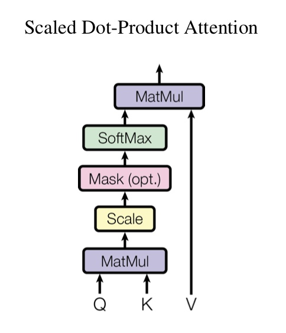
对于输入矩阵Q、K、V，经过Scaled Dot-Product Attention之后，其输出结果为：
$Attention(Q,K,V)=softmax(\frac{QK^T}{\sqrt d_k})V$，其中$d_k$是矩阵K的维度。

## Multi-Head Attention
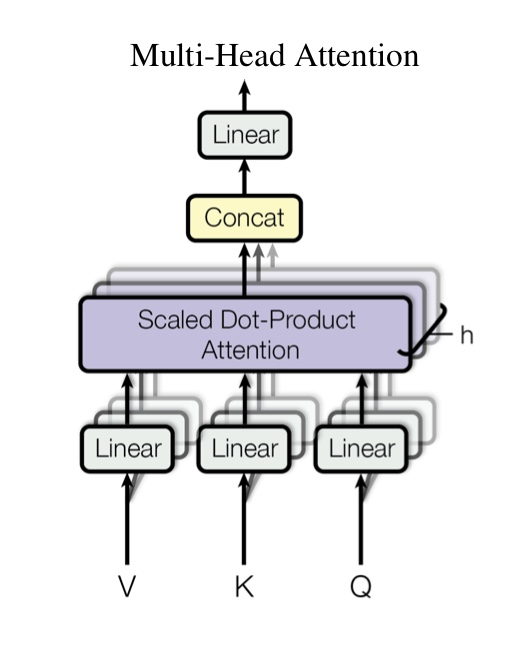
Multi-Head Attention由若干个Scaled Dot-Product Attention级联而来，其公式如下：
$MultiHead(Q,K,V)=Concat(head_1,head_2,\cdots,head_h)W^0$，其中，$head_i = Attention(QW^Q_i,KW^K_i,VW^V_i)$。

# BERT公式化表示
在本节中，BERT模型的输入均为x，为表示和计算的方便，在本文中先忽略掉Dropout函数。
## BERTLayerNorm
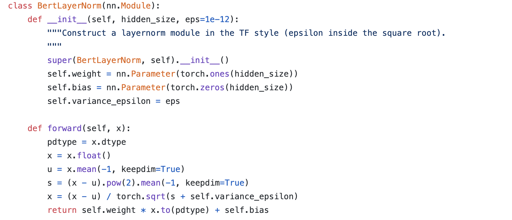
LayerNorm的公式如下：
$$\mu = \frac{1}{H}\sum\limits_{i=1}^H x_i$$
$$\sigma = \sqrt{\frac{1}{H}}\sum\limits_{i=1}^H (x_i-\mu)^2$$
$$y=LN(x)=g\odot \frac{x-\mu}{\sqrt{\sigma^2+\epsilon}} + b$$，其中，$\odot$是element-wise相乘，g和b是可学习的参数。

## BERTEmbedding
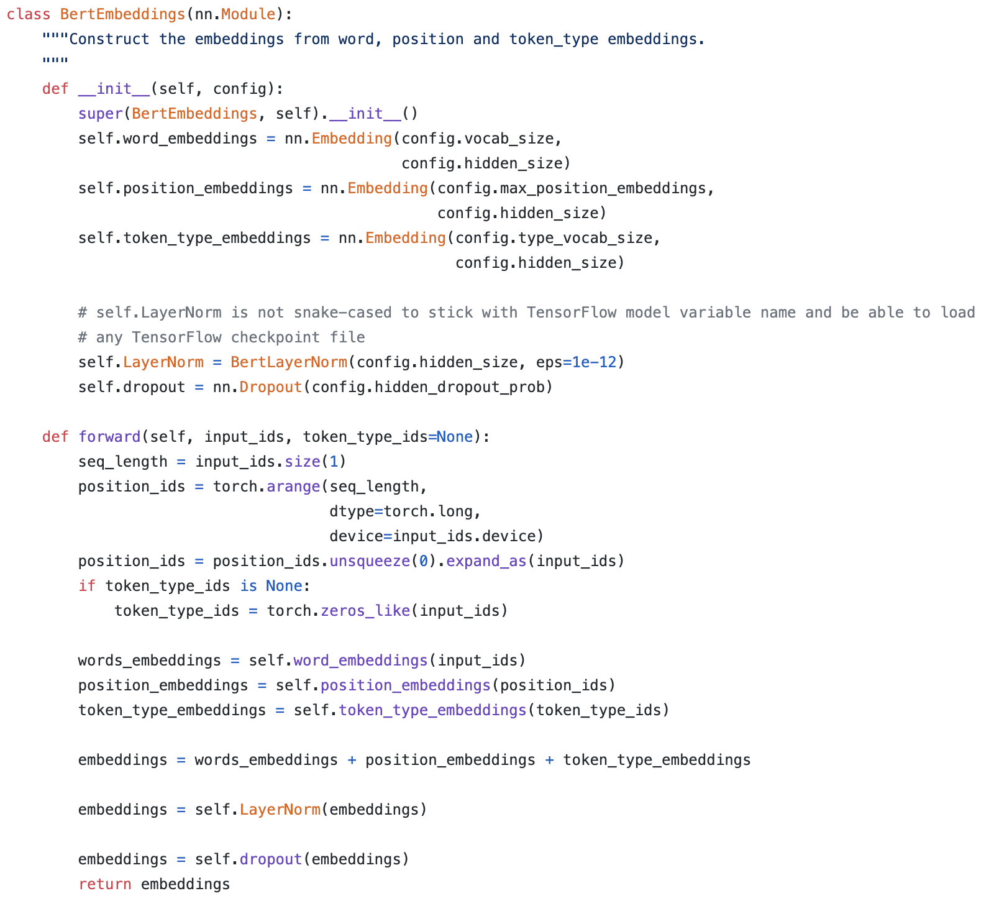
主要关注代码中的forward函数。Embedding层的输入为x，position_embedding和token_type_embedding都是基于输入x而做的变换。
令$f_{EM}=nn.Embedding$，计算公式如下：
$$word_embeddings=f_{EM1}(x)$$
$$position_embeddings=f_{EM2}(torch.arange(x.size(1)))$$
$$token_type_embedding=f_{EM3}(torch.zeros_like(x))$$
$$E=f_{EM1}+f_{EM2}+f_{EM3}$$
$$E_o=LN(E)$$

## BERTSelfAttention
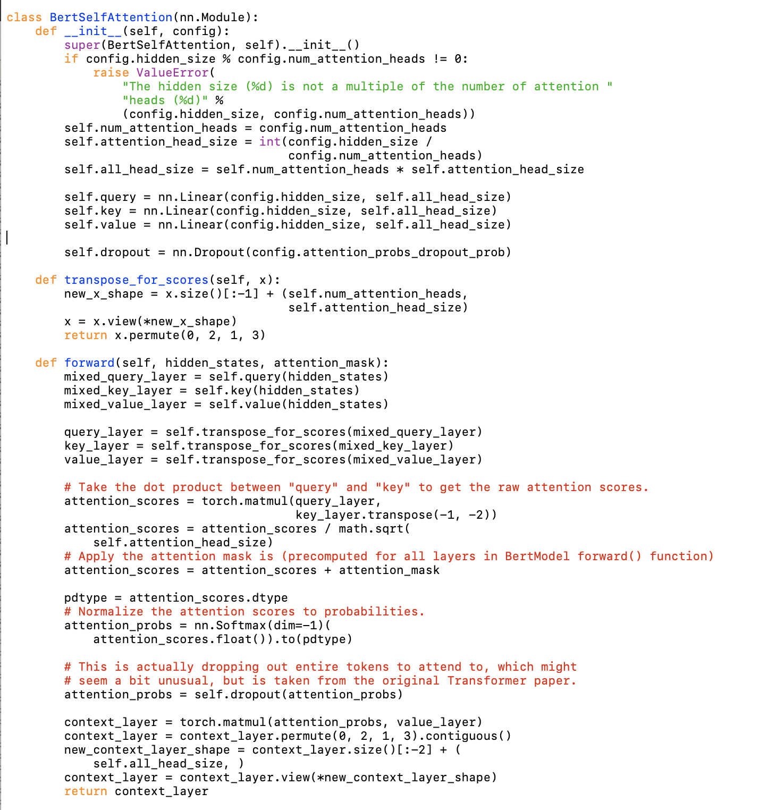
BERTSelfAttention就是最重要的attention机制部分。忽略掉代码过程中的矩阵转置等细节，实际上在这一部分，仅做了我们之前讲过的Scaled Dot-Product Attention。将这部分的数学函数定义为：$f_{SelfAtt}$。

## BERTSelfOutput
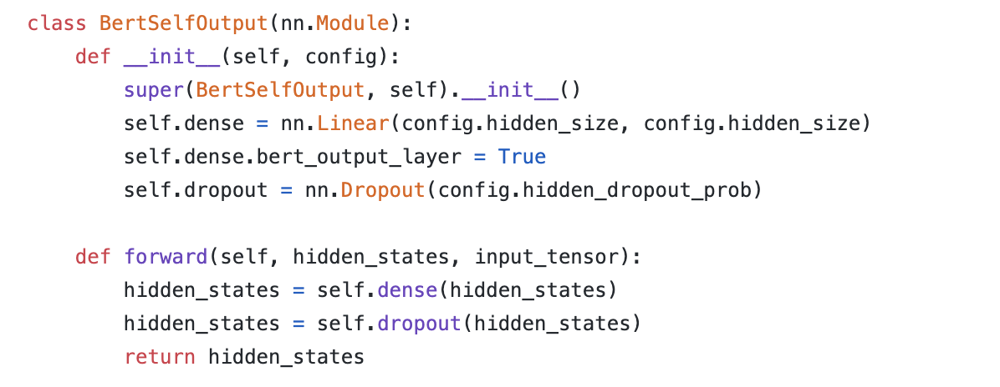
在这一部分中，SelfOutput仅做了一个线性变换和DropOut。为表示方便，将此部分的数学函数定义为：$f_{SelfOut}$。

## BERTAttention
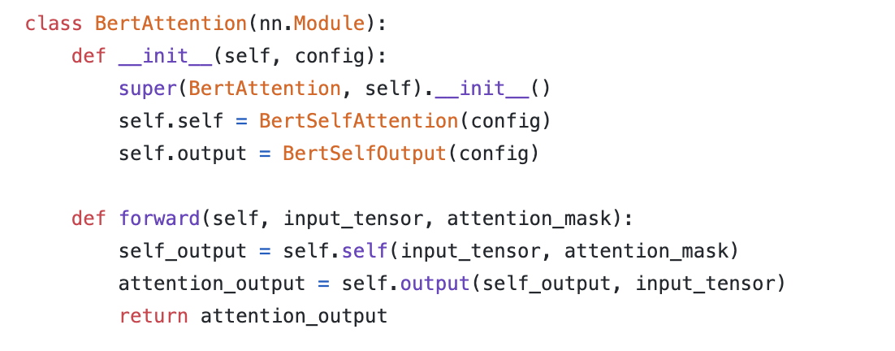
BERTAttention中包括两个部分：BERTSelfAttention和BERTSelfOutput，同样的，将此部分的数学函数定义为：$f_{Att}$。

## BERTIntermediate
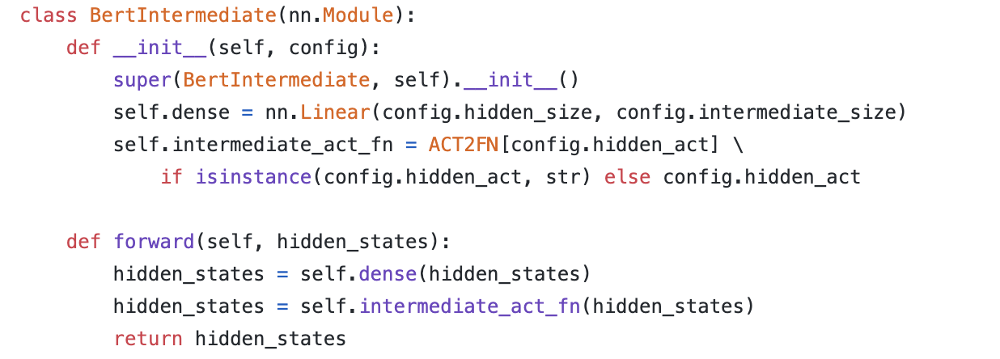
BERTIntermediate模块实际上做了一个activation的操作，将此部分的数学函数定义为：$f_{Inter}$。

## BERTOutput
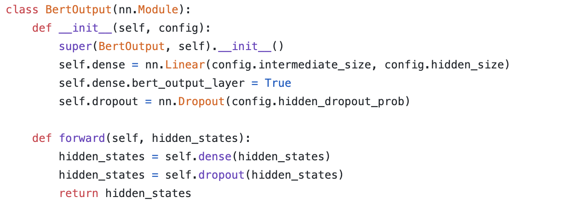
BERTOutput与BERTSelfOutput类似，同样是做了线性变换和Dropout，数学函数为$f_{Out}$。

## BERTLayer
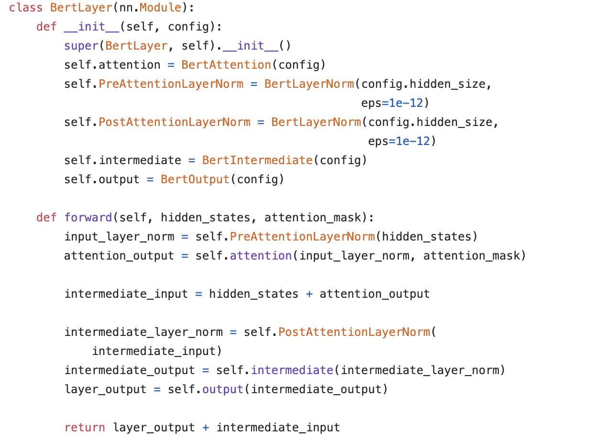
BERTLayer模块的作用是BERT模型中的具体层进行选择，在这个代码中，一个BERTLayer实际上是一个Encoder block，假设输入为x，数学函数为$f_{E}$，其数学表达式为：
$$f_{E}=Attention(LN(x))+x+Linear(Inter(LN(LN(x)+Attention(LN(x))+x)))$$
即：
$$f_{E}=f_{Att}(f_{LN}(x))+x+f_{Out}(f_{Inter}(f_{LN}(f_{LN}(x)+f_{Att}(LN(x))+x)))$$。
这是一个Encoder block中的公式表示。

## BERTEncoder
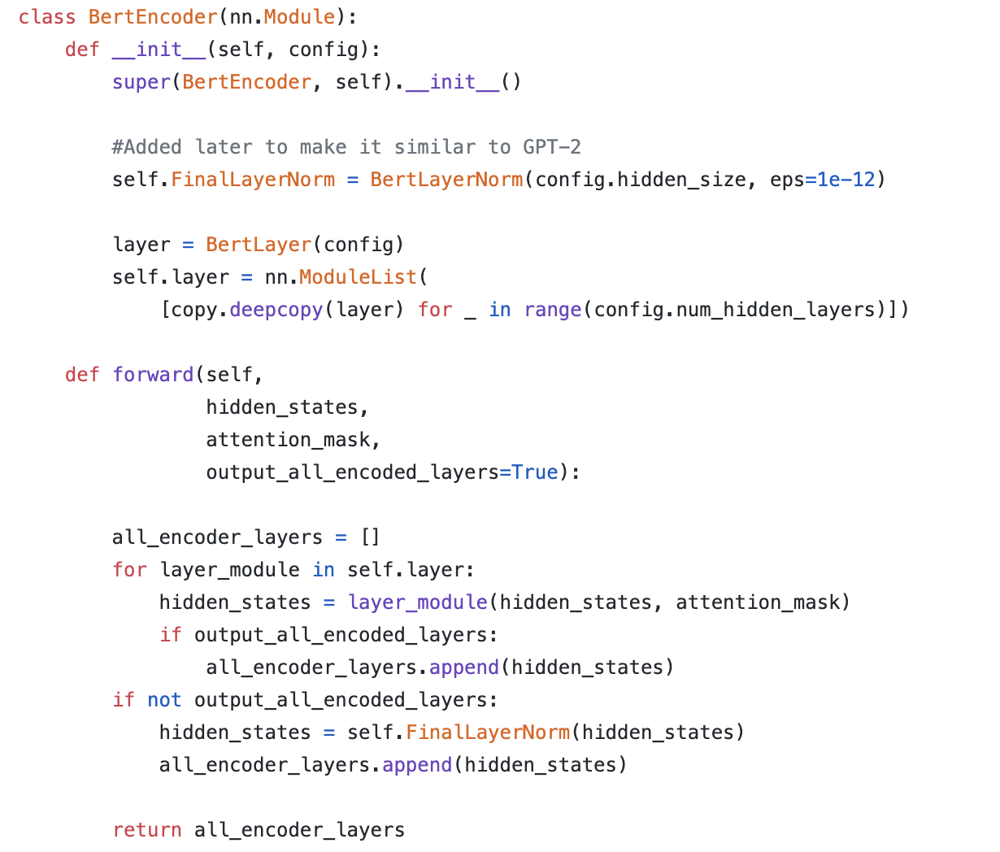
该模块在BERT模型中表示的整个的Encoder模块。

## BERTPooler
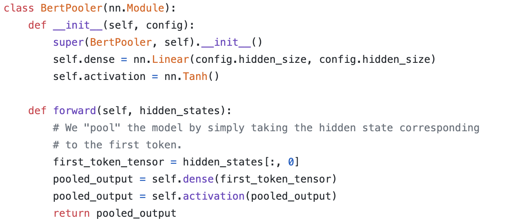
在所有的Encoder输出之后进行Pooler，数学表示为$f_{Pooler}=tanh(f_{Linear})$。

# BERT公式汇总
输入为x。
## 第一阶段Embedding
$$word_embeddings=f_{EM1}(x)$$
$$position_embeddings=f_{EM2}(torch.arange(x.size(1)))$$
$$token_type_embedding=f_{EM3}(torch.zeros_like(x))$$
$$E=f_{EM1}+f_{EM2}+f_{EM3}$$
$$E_o=f_{LN}(E)$$
## 第二阶段Encoder
$$f_{E1}=f_{Att}(f_{LN}(x))+x+f_{Out}(f_{Inter}(f_{LN}(f_{LN}(x)+f_{Att}(f_{LN}(x))+x)))$$
$$f_{E2}=f_{Att}(f_{LN}(f_{E1}))+f_{E1}+f_{Out}(f_{Inter}(f_{LN}(f_{LN}(f_{E1})+f_{Att}(f_{LN}(f_{E1}))+f_{E1})))$$
$$\cdots$$
$$f_{E12}=f_{Att}(f_{LN}(f_{E11}))+f_{E11}+f_{Out}(f_{Inter}(f_{LN}(f_{LN}(f_{E11})+f_{Att}(f_{LN}(f_{E11}))+f_{E11})))$$

## 第三阶段Pooler
$f_{Pooler}=tanh(f_{Linear}(f_{E12}))$。

## 参考文献
<div id="1">

- [1] [Vaswani A, Shazeer N, Parmar N, et al. Attention is all you need[C]//Advances in neural information processing systems. 2017: 5998-6008.] (https://arxiv.org/abs/1706.03762)

